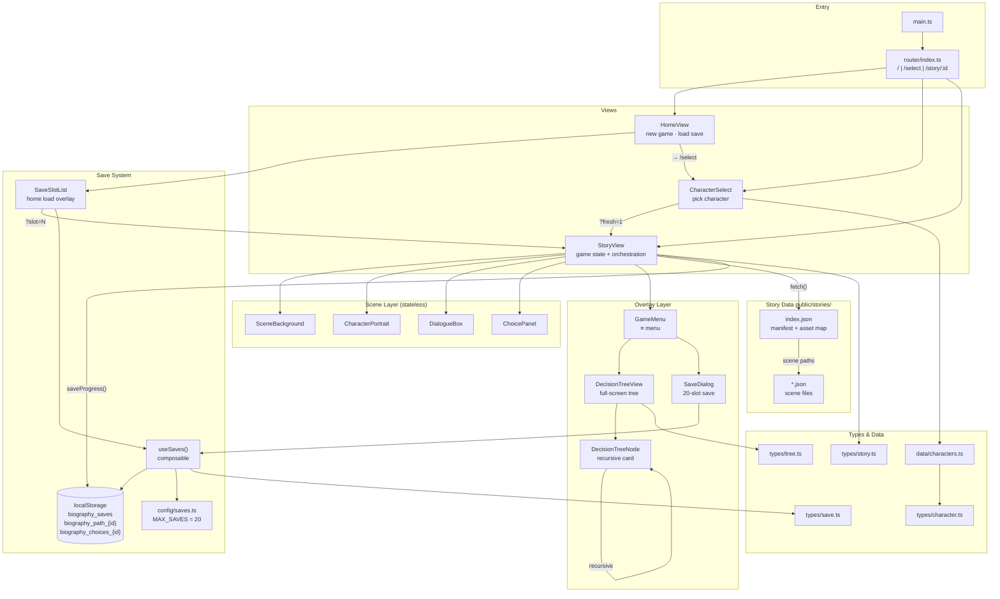

# Architecture — zz传记

> Visual novel engine built with Vue 3.5 + TypeScript + Vite.
> Story data is static JSON served from `public/`; all runtime state lives in `localStorage`.

---

## Overview

The app is a branching narrative player. Players choose a character, read scenes with background art and character portraits, make choices at branch points, and can save/load up to 20 named save slots. An in-game decision tree provides a full visual overview of the story graph and allows rewinding to any previously visited scene.

```
public/stories/{id}/     ← static story data (JSON, fetched at runtime)
src/
  main.ts                ← app entry: create Vue app, register router, mount
  router/                ← 3 routes: / · /select · /story/:characterId
  views/                 ← page-level components (HomeView, CharacterSelect, StoryView)
  components/            ← reusable UI building blocks
  composables/           ← shared logic (save system)
  types/                 ← TypeScript interfaces
  data/                  ← static character registry
  config/                ← runtime tunables (MAX_SAVES)
  styles/                ← global CSS design tokens
```

---

## Functional Areas

### 1. Application Shell

| File | Role |
|------|------|
| `src/main.ts` | Creates Vue app, registers router, mounts to `#app` |
| `src/App.vue` | Root component — single `<RouterView />` |
| `src/router/index.ts` | HTML5 history router |
| `src/styles/main.css` | Global CSS reset + design tokens (CSS custom properties) |

**Routes:**

| Path | Component | Notes |
|------|-----------|-------|
| `/` | `HomeView` | Landing: New Game / Load Save |
| `/select` | `CharacterSelect` | Character picker |
| `/story/:characterId` | `StoryView` | Main gameplay |

`StoryView` reads two optional query params:

| Param | Effect |
|-------|--------|
| `?fresh=1` | Ignore auto-save; start from `startSceneId` |
| `?slot=N` | Restore named save slot N from `biography_saves` |

---

### 2. Views

**`HomeView`**
Entry screen. Checks `useSaves().hasAnySave()` on mount to conditionally enable "读取存档". Opens `SaveSlotList` overlay for loading or navigates to `/select` for a new game.

**`CharacterSelect`**
Grid of `CharacterCard` components sourced from `src/data/characters.ts`. On confirm, pushes `/story/:id?fresh=1` so `StoryView` always starts fresh from the character select screen.

**`StoryView`** _(most complex — owns all game state)_
- Fetches `index.json` manifest, then all scene JSON files in parallel on mount
- Resolves asset aliases (`"village"` → `/bg/village.jpg`) via `resolveScene()`
- Owns `visitedPath: string[]` and `choicesTaken: Record<string, number>`, both mirrored to `localStorage` on every navigation
- Hosts the in-game overlay stack: `GameMenu`, `DecisionTreeView`, `SaveDialog`

---

### 3. Story Engine

Scene progression is managed entirely within `StoryView`:

| Function | Trigger | Effect |
|----------|---------|--------|
| `advance()` | Click on `DialogueBox` | Move to `scene.next`; append to `visitedPath` |
| `choose(choice, index)` | `ChoicePanel` emit | Record `choicesTaken[sceneId] = index`; push next scene ID |
| `rewindTo(sceneId)` | `DecisionTreeView` emit | Truncate `visitedPath` after target; clear future choice records |
| `saveProgress()` | After every navigation | Write path + choices to `localStorage` per-character keys |

**Scene components** (stateless, fully prop-driven):

| Component | Props | Purpose |
|-----------|-------|---------|
| `SceneBackground` | `src: string` | Full-bleed background image |
| `CharacterPortrait` | `src: string \| null` | Character sprite layer |
| `DialogueBox` | `speaker`, `text`, `isTerminal` | Dialogue panel + advance button |
| `ChoicePanel` | `choices: StoryChoice[]` | Choice buttons; emits `(choice, index)` |

---

### 4. Save System

Two storage tiers, both in `localStorage`:

| Key | Contents | Written by |
|-----|----------|-----------|
| `biography_path_{characterId}` | `string[]` — visited scene IDs | `StoryView.saveProgress()` |
| `biography_choices_{characterId}` | `Record<string, number>` — choice indices | `StoryView.saveProgress()` |
| `biography_saves` | `SaveSlot[]` — named save slots | `useSaves.save()` |

The auto-save keys (`biography_path_*`) handle session recovery. The named saves key holds up to `MAX_SAVES` slots for explicit player saves.

| File | Role |
|------|------|
| `src/config/saves.ts` | `MAX_SAVES = 20` — single constant to change the slot limit |
| `src/types/save.ts` | `SaveSlot` interface |
| `src/composables/useSaves.ts` | `loadAll()` · `save()` · `hasAnySave()` — pure `localStorage` helpers |
| `src/components/SaveDialog.vue` | In-game overlay: all 20 slots, inline name input, writes via `useSaves.save()` |
| `src/components/SaveSlotList.vue` | Home-screen overlay: filled slots only, navigates on click |

**`SaveSlot` shape:**
```typescript
{
  slotIndex: number                    // 0-based position in the array
  name: string                         // user-defined label
  characterId: string
  visitedPath: string[]
  choicesTaken: Record<string, number>
  savedAt: number                      // Date.now() timestamp
}
```

---

### 5. In-Game Menu & Decision Tree

The `≡` button (fixed top-right, z-index 10) opens `GameMenu`. It emits four events back up to `StoryView`:

| Emit | StoryView action |
|------|-----------------|
| `show-tree` | `showTree = true` |
| `save` | `showSave = true` |
| `home` | `router.push('/')` |
| `close` | `showMenu = false` |

**Decision Tree** renders the complete story graph as a horizontal card tree:

- **`DecisionTreeView`** — builds the `TreeNode` graph from `visitedPath` / `choicesTaken`, owns the full-screen overlay chrome and scroll container
- **`DecisionTreeNode`** — recursive card component; each card shows the scene's background thumbnail, speaker name, dialogue preview, and a status tag

Node states:

| Visual | Meaning | Interaction |
|--------|---------|-------------|
| Gold border `◆ 当前` | Currently active scene | None |
| `↩ 点击回溯` | Previously visited | Click → `rewindTo()` |
| 40% opacity `○ 未到达` | Not yet reached | None |
| Ghost card `❓` | Untaken branch end | None |

---

### 6. Story Data Format

Stories live under `public/stories/{characterId}/` and are fetched at runtime via `fetch()`.

**Manifest (`index.json`):**
```json
{
  "id": "warrior",
  "startSceneId": "w_001",
  "defaultSpeaker": "战士",
  "assets": {
    "bg":      { "village": "/bg/village.jpg", "battlefield": "/bg/battlefield.jpg" },
    "portrait": { "neutral": "/portraits/warrior_neutral.png" }
  },
  "scenes": ["w_001.json", "w_002.json", "past/w_past_001.json", "w_end.json"]
}
```

**Linear scene:**
```json
{ "id": "w_001", "background": "village", "portrait": "neutral",
  "text": "多年未见，你是来找我的？", "next": "w_002" }
```

**Choice scene:**
```json
{ "id": "w_002", "background": "village", "text": "说吧，有什么事。",
  "choices": [
    { "text": "询问他的过去",  "nextSceneId": "w_past_001" },
    { "text": "直接谈任务",    "nextSceneId": "w_mission_001" }
  ]
}
```

Asset fields (`background`, `portrait`) are resolved against the manifest's `assets` map. If no match, the raw string is used directly, allowing absolute URLs.

---

## Key Execution Flows

### New Game
```
HomeView → /select
CharacterSelect → /story/warrior?fresh=1
StoryView.onMounted:
  fetch index.json + all scene JSONs (parallel)
  ?fresh=1 → visitedPath = [startSceneId], choicesTaken = {}
  saveProgress() → localStorage auto-save
render first scene
```

### Load Named Save
```
HomeView → SaveSlotList overlay → click slot N
router.push(/story/warrior?slot=N)
StoryView.onMounted:
  fetch story data
  ?slot=N → useSaves.loadAll()[N] → restore visitedPath, choicesTaken
  saveProgress() → sync auto-save with loaded state
render last visited scene
```

### Scene Progression (linear)
```
Player clicks dialogue
DialogueBox emits 'advance'
StoryView.advance():
  visitedPath.push(scene.next)   ← only if not already present
  currentScene = scenes[next]
  saveProgress()
```

### Scene Progression (choice)
```
Player clicks a choice button
ChoicePanel emits ('choose', choice, index)
StoryView.choose(choice, index):
  choicesTaken[currentSceneId] = index
  visitedPath.push(choice.nextSceneId)
  currentScene = scenes[choice.nextSceneId]
  saveProgress()
```

### Rewind via Decision Tree
```
Player: ≡ → 决策树 → click visited card
DecisionTreeNode emits 'rewind' with sceneId
StoryView.rewindTo(sceneId):
  idx = visitedPath.indexOf(sceneId)
  removed = visitedPath.splice(idx + 1)   ← truncate future
  removed.forEach(id => delete choicesTaken[id])
  delete choicesTaken[sceneId]            ← allow re-choosing here
  currentScene = scenes[sceneId]
  saveProgress()
  close all overlays
```

### In-Game Save
```
Player: ≡ → 存档 → click slot → edit name → confirm
SaveDialog calls useSaves.save(slot):
  all = loadAll()                        ← sparse array, length = MAX_SAVES
  all[slot.slotIndex] = slot
  localStorage.setItem('biography_saves', JSON.stringify(all.filter(Boolean)))
Dialog closes
```

---

## Architecture Diagram



---

## How to Extend

### Add a New Character
1. Create `public/stories/{id}/index.json` with manifest
2. Add scene JSON files (flat or in subdirectories)
3. Add an entry to `src/data/characters.ts`

No other code changes needed — the router and `StoryView` are fully generic.

### Change the Save Slot Count
Edit the single constant in `src/config/saves.ts`:
```typescript
export const MAX_SAVES = 20   // ← change this number
```
`SaveDialog` and `useSaves` both read this value; the UI updates automatically.
