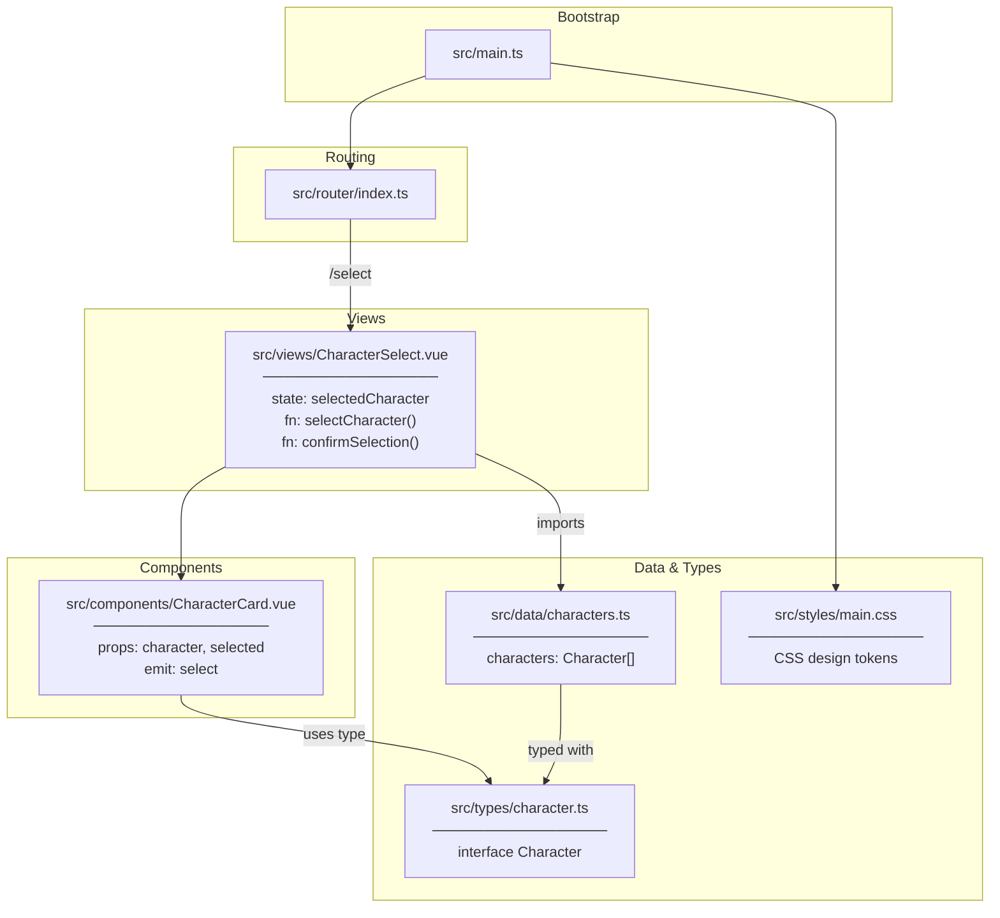

# Architecture

## Overview

**zz-biography** is a Vue 3 single-page application built as a character selection interface. Users browse a grid of characters, select one, and confirm their choice. The architecture is intentionally minimal: static data, a single view, one reusable component, and a shared type contract.

- **Tech stack:** Vue 3.5 (Composition API) · TypeScript 5.9 · Vue Router 5 · Vite · pnpm
- **Files:** 8 source files across entry, router, view, component, data, types, and styles

---

## Functional Areas

### 1. Application Bootstrap (`src/main.ts`)
Creates the Vue app instance, registers the router plugin, imports global styles, and mounts to `#app`.

### 2. Routing (`src/router/index.ts`)
HTML5 history-mode router with two routes:
- `/` → redirects to `/select`
- `/select` → renders `CharacterSelect` view

### 3. Views (`src/views/`)
| File | Responsibility |
|------|----------------|
| `CharacterSelect.vue` | Page-level orchestrator: loads character data, manages `selectedCharacter` state, renders the card grid, handles confirm action |

### 4. Components (`src/components/`)
| File | Responsibility |
|------|----------------|
| `CharacterCard.vue` | Stateless presentational card — receives `character` + `selected` props, emits `select` event on click |

### 5. Data (`src/data/`)
| File | Responsibility |
|------|----------------|
| `characters.ts` | Static array of 3 characters: Warrior (战士), Mage (法师), Ranger (游侠) |

### 6. Types (`src/types/`)
| File | Responsibility |
|------|----------------|
| `character.ts` | `Character` interface — `{ id, name, avatar, description }` — shared across data, view, and component |

### 7. Styles (`src/styles/main.css`)
Global CSS custom properties (design tokens) for colors, spacing scale, border radii, shadows, and transition speeds. Also includes box-model reset and base typography.

---

## Key Execution Flows

### Character Selection Flow
```
User clicks CharacterCard
  → CharacterCard emits `select` event with Character payload
  → CharacterSelect.selectCharacter() sets selectedCharacter ref
  → Confirm button becomes enabled
  → User clicks confirm
  → CharacterSelect.confirmSelection() logs selection
    (extension point: future navigation to game/biography view)
```

### App Initialization Flow
```
main.ts
  → createApp(App)
  → app.use(router)          # registers Vue Router
  → import styles/main.css   # global tokens + reset
  → app.mount('#app')
  → router matches /  →  redirect to /select
  → CharacterSelect rendered
  → characters[] imported from data/characters.ts
  → CharacterCard × 3 rendered
```

---

## Architecture Diagram



---

## Extension Points

The codebase is intentionally scaffolded for growth. Key extension points:

| Location | What to add |
|----------|-------------|
| `confirmSelection()` in `CharacterSelect.vue:13` | Router navigation to game/biography view after selection |
| `src/data/characters.ts` | More characters or switch to API fetch |
| `src/router/index.ts` | New routes (e.g., `/biography/:id`, `/game`) |
| `src/types/character.ts` | Richer character fields (stats, skills, backstory) |
| `src/styles/main.css` | Dark mode via `@media (prefers-color-scheme: dark)` |
